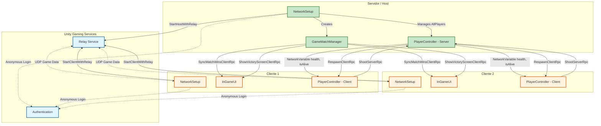

# Sistema de Redes para Jogos - Projeto Final

## Miguel Filipe nº22408872

### Introdução

O projeto consiste num simples jogo dos tanques onde dois jogadores vão um contra o outro, as balas podem acertar no seu próprio tanque e estas rebatem pelas paredes do cenário tal como uma parede que é alterada dinâmicamente ao longo do jogo.

### Estado/Uso

O projeto encontra-se com alguns bugs em termos de gameplay, porém 100% funcional em termos de network.

Instruções (por LAN):

- Uma build corre em servidor pela opção Server e copia-se o código presente no canto superior esquerdo do ecrã.
- Jogadores entram nesse servidor pelo código copiado.

Controlos:

- Setas horizontais - Virar.
- Setas verticais - Mover.
- Espaço - Disparar.

### Técnicas

O jogo funciona sobre Unity Relay, utilizando o Unity Netcode for GameObjects para a lógica cliente/servidor, sem qualquer sistema de login ou matchmaking – apenas a Unity Authentication é usada para aceder ao Relay, não para autenticação de jogadores.

Ao executar a build, os argumentos da linha de comandos determinam o papel: --server para iniciar um servidor, ou --code <joinCode> para um cliente se juntar a esse servidor. Uma única build serve tanto para correr o servidor como para jogar pois estes argumentos são executados dependendo do botão pressionado no menu principal, sendo "Server" para iniciar o servidor e "Join" com o código escolhido para o cliente se juntar.

Os tanques (PlayerController), as balas e a parede rotativa são NetworkBehaviours. O servidor instancia as balas disparadas pelos jogadores através de ServerRpc, e a parede usa um NetworkTransform para manter a sua rotação sincronizada entre todos os clientes. As balas também têm um NetworkObject para serem visíveis em toda a rede.

O NetworkSetup regista cada jogador que entra (AllPlayers), e essa lista é usada pelo InGameUI para atribuir barras de vida e placares aos tanques corretos. O estado de saúde e o estado "vivo/morto" de cada tanque são NetworkVariable<int> currentHealth e NetworkVariable<bool> isAlive – quando o servidor os altera, todos os clientes recebem a atualização automaticamente. O movimento local é processado no cliente dono do tanque, mas ações críticas (disparar, sofrer dano) são validadas no servidor via ServerRpc, garantindo autoridade do servidor contra batota.

Em vez de destruir o tanque quando este morre, o servidor desativa os seus componentes visuais e de colisão (através de UpdateTankState) e sincroniza isAlive = false. Após uma ronda, o servidor chama RespawnClientRpc, que reposiciona e reativa o tanque em todos os clientes – não é necessário recarregar a cena.

Os projéteis são instanciados pelo servidor no momento do disparo. Cada cliente cria a sua cópia local para que o movimento seja visualmente fluido, mas só o servidor decide quando uma bala acerta (através de OnCollisionEnter2D no servidor) e aplica dano.

O InGameUI subscreve eventos estáticos (OnAnyPlayerHealthChanged, OnMatchWinsChanged) para atualizar as barras de vida e os placares em tempo real, sem procurar objetos repetidamente. O GameMatchManager, também um NetworkBehaviour, mantém um NetworkVariable<bool> gameReady que só fica true quando existem dois clientes ligados – só a partir desse momento os tanques se podem mover.

### Banda e custos

Tráfego estimado por cliente em jogo ativo:

- Movimento/rotação (NetworkTransform): ~10 pacotes/segundo × 50 bytes, seria por volta de 4 Kbps.

- Atualizações de vida: apenas quando ocorre dano (poucos eventos).

- Disparos: cada tiro gera um ServerRpc (cliente→servidor) e a instanciação da bala (multicast). Em tiroteio intenso (~4 tiros/segundo) seria no máximo 10Kbps.

- Total estimado: < 50 Kbps.

- Relay: Uma hora de jogo com 2 jogadores consome cerca de 2 MB de tráfego.

### Mensagens de Rede

- ShootServerRpc                   : Cliente pede ao servidor para disparar    : Cliente -> Servidor

- TakeDamage (Chamado no servidor) : Servidor baixa a vida do tank             : Servidor -> Todos (networkVariable)

- Die + IsAliveValue = false       : Servidor sincroniza se um tank está morto : Servidor -> Todos

- RespawnClientRpc                 : Servidor reposiciona um tank e reativa    : Servidor -> Todos

- SyncMatchWinsClientRpc           : Servidor atualiza os pontos               : Servidor -> Todos

- ShowVictoryScreenClientRpc       : Servidor manda mostrar o ecrã final       : Servidor -> Todos

- gameReady (networkVariable)      : Servidor indica se já existem 2 jogadores : Servidor -> Todos

### Diagrama de Redes

### Bibliografia

A pesquisa para a construção deste projeto focou-se maioritariamente nos videos do professor da disciplina tal como a utilização do código de networking providenciado pelo mesmo, modificado para obter a funcionabilidade atual : <https://www.youtube.com/@diogoandrade9588>

Unity Netcode for GameObjects : <https://docs.unity3d.com/Packages/com.unity.netcode.gameobjects@2.11/manual/index.html>

Unity Relay : <https://docs.unity.com/relay>

Unity Authentication : <https://docs.unity.com/authentication>

Ajuda de AI : <https://www.deepseek.com/>
